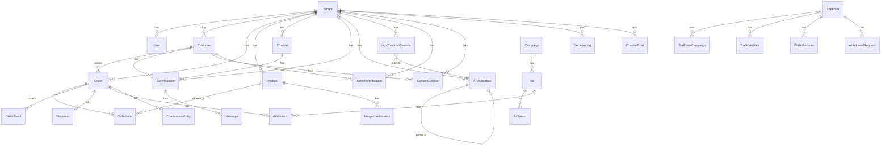

# Entity Relationship Diagram

This document describes the core data model of ZIAY (Comercio Conversacional + Atribución Inteligente). The Prisma schema (`prisma/schema.prisma`) defines **68 models**, of which **60 are tenant-scoped** (carry a `tenantId` FK) and **8 are global** (`Setting`, `Tenant`, `AuditLog`, etc.).

> **Auto-generated ERD:** `bunx prisma generate` now emits an SVG diagram at [`docs/erd.svg`](./erd.svg) via [`prisma-erd-generator`](https://github.com/kevinswiber/prisma-erd-generator) + [`@mermaid-js/mermaid-cli`](https://github.com/mermaid-js/mermaid-cli). The SVG is the canonical visual reference; the Mermaid block below is a hand-curated overview of the key models.

The diagram below shows the key models and their relationships. It is intended as a navigation aid — for the canonical definition, always consult `prisma/schema.prisma`.

## Core Models



## Multi-Tenancy

Every tenant-scoped model carries a `tenantId` foreign key pointing to `Tenant.id`. The middleware + `requireTenantAccess` / `requireAuth` helpers enforce tenant isolation at the API layer; the database-level Row-Level Security (RLS) helper (`src/lib/rls.ts`) is available for direct Prisma queries that need an extra defense-in-depth layer.

**Global models (8):**
- `Tenant` — the root entity (slug, name, currency, country).
- `User` — login identity (email + password hash + role). Each user belongs to a tenant (except `platform-admin`).
- `Setting` — key/value config (global app settings, not tenant-scoped).
- `AuditLog` — append-only event log (action + entity + entityId + metadata + tenantId optional). Used for webhook dedup, compliance trail, and verifiable intents. (The `meta` column was dropped in Sprint 5D — all reads + writes now use `metadata`.)
- `WebhookEvent` — durable idempotency log for webhook dedup.
- `ApiKey` — hashed API tokens for service-to-service auth.
- `McpSession` — MCP JSON-RPC session state (per agent).
- `Migration` — Prisma migration history (managed by `prisma migrate`).

## Protocol Trinity (AP2 / UCP / ACP / MCP / A2A)

The **AP2 Intent Mandate** is the cryptographic anchor of the agent-driven checkout flow. A W3C Verifiable Credential signed by the tenant's ed25519 key authorizes an AI agent to act on behalf of a human user, bounded by:

- `maxAmount` — global cap on cart total.
- `categoryLimits` — per-category caps (JSON map).
- `expiresAt` — temporal validity.
- `purpose` — human-readable reason (auditable).

The mandate chain is:
```
Intent Mandate (root, signed by user)
  └── Cart Mandate (signed by agent, parent = Intent)
        └── Payment Mandate (signed by agent, parent = Cart, intentCartHash binds to Intent+Cart)
```

`UcpCheckoutSession` advances through a state machine:
```
incomplete → requires_escalation → ready_for_complete → completed
                                     ↑
                       (governance / age gate / KYC can force back)
```

The `ACP v1` routes (`/api/acp/v1/checkout`, `/orders/[id]`, `/refunds`) authenticate the external AI agent (ChatGPT, Copilot) via the signed bearer `{mandateId}.{ed25519(mandateId)}` — not the raw mandate ID.

The `MCP` route (`/api/mcp`) exposes the 4 UCP capabilities as JSON-RPC 2.0 tools invocable by Claude / ChatGPT.

## Compliance Models

- `IdentityVerification` (KYC) — Ley 2573 Colombia. Required for `credit` / `installment` payment modes. Status: `pending` / `verified` / `rejected`.
- `ConsentRecord` (Ley 1581) — consent for data processing + DSR (Data Subject Request) audit. Types: `data_processing`, `marketing`, `parental_consent_minor`, `dsr_access`, `dsr_deletion`, `dsr_portability`.
- `DecisionLog` — Verifiable Intent audit trail (governance decisions, mandate enforcement, escalation queue).

## Attribution Models

- `Attribution` — links an `Order` to an `Ad` (closed-loop). Driven by the CTWA `click_id` captured at WhatsApp inbound + inherited through the conversation → order chain.
- `AdSpend` — daily ad spend (imported from Meta / Google / TikTok Ads API).
- `ChannelCost` — per-channel cost (WhatsApp Cloud API, Meta Ads platform fee) for the channel contribution margin service.
- `CommissionEntry` — trafficker / marketplace commission (per order). Uses upsert to avoid the POST race condition.

## Model Count

- **Total models:** 68
- **Tenant-scoped:** 60
- **Global:** 8 (Setting, Tenant, AuditLog, WebhookEvent, ApiKey, McpSession, Migration, User)

## Relationship Cardinality Cheat Sheet

| Symbol | Meaning |
|--------|---------|
| `\|\|--o{` | one to zero-or-many |
| `\|\|--\|{` | one to one-or-many (mandatory) |
| `\|\|--o\|` | one to zero-or-one |
| `}o--\|\|` | zero-or-many to one (reverse direction) |
| `}o--o{` | many-to-many |

## See Also

- `prisma/schema.prisma` — canonical model definitions (do not modify without a migration).
- `docs/openapi.yaml` — API surface (mounts ReDoc at `/docs`).
- `docs/DR-RUNBOOK.md` — disaster recovery + backup / restore procedures.
- `docs/STYLE_GUIDE.md` — code style + naming conventions.
- `CHANGELOG.md` — release history (Keep-a-Changelog format).
